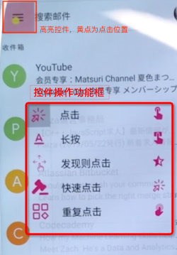
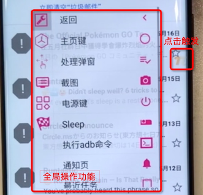
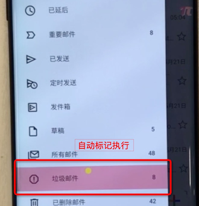
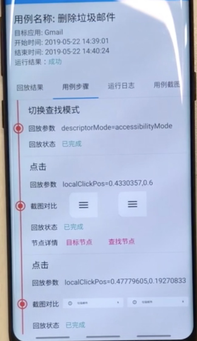
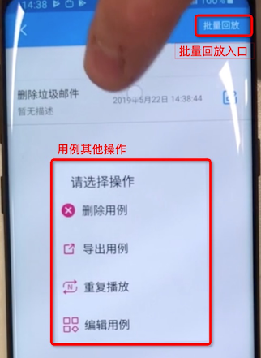
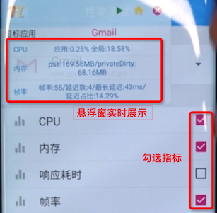
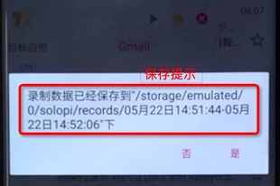

# Soloπ
## 关于工具

   Soloπ是一个无线化、非侵入式的Android自动化工具，公测版拥有录制回放、性能测试、一机多控三项主要功能，能为测试开发人员节省宝贵时间。

## 运行环境要求

- Android 4.3+

- 手机初始化需要依赖PC（具备adb运行环境），详见下文

## 环境准备

### Android设备调试模式

   需要开启 Android 设备USB调试功能（常见位置：设置 -> 开发者选项 -> USB调试功能。如果设置中不包含开发者选项，请参考 https://developer.android.com/studio/debug/dev-options?hl=zh-cn#enable 中的`启用开发者选项和调试`）。

### 常见问题

   VIVO设备需要开启开发者选项中的`USB安全操作`（如有），否则录制回放与一机多控功能可能会无法正常操作。

   小米设备需要开启开发者选项中的 `USB安装`与`USB调试（安全设置）`并手动开启Soloπ应用权限中的`后台弹出界面`选项，否则可能无法正常使用。

### 初始化手机环境

   在手机开机的情况下，通常只需要进行一次初始化，手机的初始化依赖电脑上的adb命令，请参考网上的一些adb配置文档进行准备，比如 [**https://sspai.com/post/40471**](https://sspai.com/post/40471) 。对于Window系统，可能需要安装对应设备的驱动才能连接。

   adb环境配置完成并连接上设备后，在电脑控制台中执行 `adb tcpip 5555` 来开启设备远程adb调试端口。

   远程端口开启后，进入Soloπ，按照提示授予相应权限，即可完成环境准备。

## 功能使用

### 录制回放

   整体录制回放的流程可以参考公众号文章中 **删除垃圾邮件** 和 **游戏自动化** 两个视频。

#### 录制

   进入录制界面后，选择待测应用并输入用例名称，点击开始。

Soloπ会弹出一个悬浮窗，进入到想要操作的界面，点击绿色箭头即可开始录制。

   录制时点击屏幕上控件，Soloπ会用红色框高亮对应控件，并显示控件操作功能框，Soloπ提供了点击、长按、发现则点击、输入文字、相对点击位置滑动、断言、设置变量等功能。如果发现高亮位置有问题，可以点击操作框外取消选择；如果多次点击均不能定位到控件，可以使用重载界面功能重新加载页面结构，也可以切换为图像查找模式进行查找。

   Soloπ包含了一些常用的操作功能，包括返回、处理弹窗、截图、回到首页、切换查找模式、Scheme跳转、屏幕滑动、Sleep等功能，可以通过点击屏幕右侧的"π"悬浮窗触发（全局操作模式下不会有红色高亮框）。

   如果想要停止或暂停录制，可以点击右侧"π"图标，在最后一项中选择停止或者暂停。当你想从暂停状态恢复时，点击右侧的"π"图标即可。

#### 回放

   可以通过点击录制回放首页里的最近录制项或全部用例列表中的用例来回放用例，Soloπ会自动跳转到待测应用，并显示悬浮窗，请手动进入录制用例时的起始页面，点击绿色箭头开始回放，Soloπ会自动回放这条用例，并在用例回放完成时显示回放结果。

   在回放结果页，Soloπ会显示用例的执行状态，每一步的操作信息（包括截图、控件信息、状态、执行参数），被测应用运行日志（保存在文件，结果页显示部分日志）和截图。

#### 其他功能

   在全部用例列表页，可以通过长按来删除、重复执行或编辑用例，用例编辑页面里支持删除用例、调整用例顺序、添加新步骤、编辑用例信息。点击用例列表右上角批量回放功能，可以勾选用例依次进行回放。

### 一机多控

#### 建立连接

   一机多控分为主从机两部分，通过网络进行通信，所以请保持主从机在同一网络环境下。在主机上选择需要测试的应用，配置为主机模式，从机需要配置为从机。点击开始执行后，主机会显示"扫码添加设备"和"点击连接设备"的悬浮窗，从机会显示二维码图标。主机上通过扫码与从机建立通信后，点击连接设备完成连接，从机的二维码悬浮窗会缩小为"π"图标。

#### 操作

   连接完毕后，在主机上点击绿色三角即可开始多控操作（操控初始请保持主从机在同一页面）。主机上的操作方式与录制用例时一致，每执行一步，从机会跟随主机的步骤同步执行。
   为便于统一安装应用，一机多控增加了安装应用和下载文件两项功能（对于Vivo和OPPO手机，安装应用需要输入密码，请在Soloπ设置中填写密码信息，以便自动安装）。
   在主机执行过程中，可以通过添加从机功能动态添加设备。

#### 退出

   当使用完毕后，可以在主机上使用结束功能结束一机多控，主从机会同时退出连接。如果只想退出一台从机，可以在从机上点击右侧"π"图标退出分组，结束一机多控。

### 性能工具

性能工具主要分为三块：常规性能测试、响应耗时测试、性能加压。

#### 常规性能测试

   在性能测试页选择待测应用，勾选需要测试的性能指标，即可开始进行性能测试，Soloπ会显示性能悬浮窗，实时展示性能数据，点击悬浮窗上的应用文字可直接跳转到对应应用。

   如果想要记录一段时间内的性能变化情况，可以点击悬浮窗的绿色三角开始录制，停止时点击红色圆形，Soloπ会弹出悬浮窗提示保存的位置（以CSV的格式保存，也可以在性能工具首页-录制数据查看菜单中查看之前录制的数据），并恢复为实时展示模式。

#### 响应耗时测试

   点击启动耗时计算功能，第一次进入会提示是否加载计算插件，点击确认进行加载。加载完成后再次点击即可进入。

   首先配置录屏的相关参数，主要关注二值对比差异一项，如果测试场景不关注页面细微变化，可以设置一个较高的二值对比差异值，比如设置为"2"（表示前后两帧图片像素点差异需超过2%才认为响应结束）。

   点击启动按钮，Soloπ会弹出开始录制悬浮窗，请手动进入需要测试的功能入口，点击开始录制，手动点击相应入口控件，待页面加载完毕后，点击结束录制，Soloπ会计算并显示实际跳转的耗时。

#### 性能加压

   Soloπ同时支持内存与CPU加压。在性能工具底部，滑动配置单核CPU负载百分比、占用CPU核数、内存占用大小，即可进行加压（注意，由于设备总内存有限，如果配置内存加压过高，会导致系统资源不足，可能会导致Soloπ进程被杀掉）。

## 下载地址

   大家可以直接下载 Soloπ.apk 使用。如果你觉得工具对你有些帮助，欢迎点一下右上角的三个功能哈~

   在使用过程中遇到了什么问题的话，可以在体验交流群里进行留言，我们的交流群二维码如下图。

